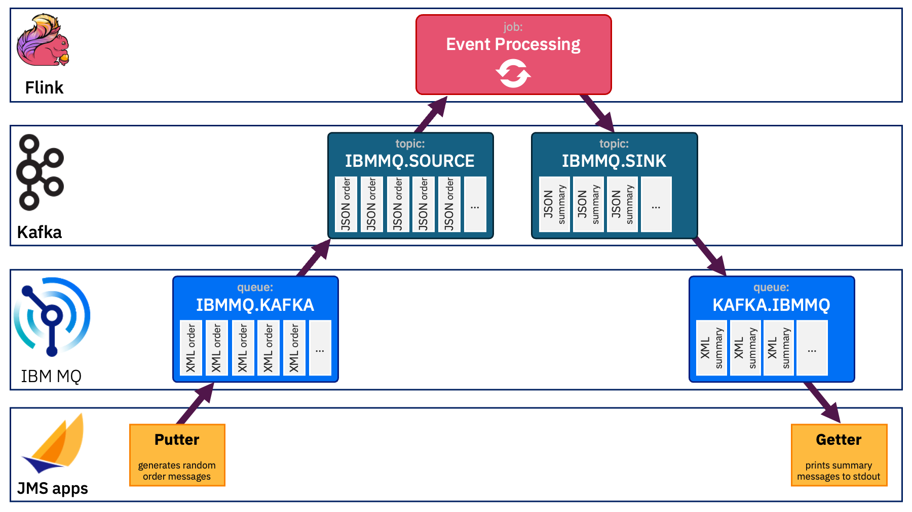

# Event Automation demos

I use https://github.com/IBM/event-automation-demo to setup demos that I give using IBM Event Automation. But sometimes it helps to have additional streams of events to use to illustrate other event-driven ideas. This repo contains the setup I am currently using for that.

## Pre-requisites

1. Create the default IBM Event Automation demo environment
    - Use the instructions [here](https://github.com/IBM/event-automation-demo/blob/main/INSTALL-OPTIONS.md) (choose one of the options with persistent storage)
2. Seed the Event Endpoint Management catalog
    - Use the instructions [here](https://github.com/IBM/event-automation-demo/tree/main?tab=readme-ov-file#step-2---populate-the-catalog)
3. Modify the Kafka Connect deployment to start adding additional connectors
    ```sh
    oc apply -f mqtt-credentials.yaml
    oc apply -f kafka-connect.yaml
    ```

## Instructions

Each of these demos is self-contained. As long as you have the [Pre-requisites listed above](#pre-requisites), you can pick and choose whichever data source(s) you need for a demo that you want to give.

### IBM MQ with XML messages

1. Create the IBM MQ queue manager
    - Use the instructions [here](https://github.com/IBM/event-automation-demo/blob/main/INSTALL-OPTIONS.md#ibm-mq)
2. Create the MQ message schemas
    ```sh
    oc apply -f mq-schemas.yaml
    ```
3. Create the topics
    ```sh
    oc apply -f mq-topics.yaml
    ```
4. Update [`kafka-connect.yaml`](./kafka-connect.yaml) to un-comment the `connect-schemas-ibmmq` sections in:
    - `.spec.template.connectContainer.volumeMounts`
    - `.spec.template.pod.volumes`
5. Apply the updated Kafka Connect spec
    ```sh
    oc apply -f kafka-connect.yaml
    ```
6. Create the connectors
    ```sh
    oc apply -f mq-connectors.yaml
    ```
7. Build the IBM MQ apps
    ```sh
    cd apps/ibmmq
    mvn clean package

    oc apply -f ocp-build.yaml
    oc start-build bc/eventautomation-mq-demo-apps -n event-automation --from-file=./target/mq-demo-app-0.0.1-jar-with-dependencies.jar --follow
    ```
8. Deploy the IBM MQ apps
    ```sh
    oc apply -f ocp-deploy.yaml
    ```

**To demonstrate the source connector:**
- the "putter" MQ app is putting XML MQ messages such as [this sample](./sample-messages/IBMMQ.KAFKA.xml) to the `IBMMQ.KAFKA` topic
- verify the JSON representation of the Kafka message on Event Streams on the `IBMMQ.SOURCE` topic

**To demonstrate the sink connector:**
- use Event Processing to process the events from the `IBMMQ.SOURCE` topic and output the results to the `IBMMQ.SINK` topic
- verify the XML representation of the message on the `KAFKA.IBMMQ` IBM MQ queue using the log of the "getter" MQ app

**Overview:**


**To add the topics to Event Endpoint Management:**
```sh
./add-to-catalog.sh  <EEM ACCESS TOKEN>  IBMMQ.SOURCE
./add-to-catalog.sh  <EEM ACCESS TOKEN>  IBMMQ.SINK
```

---

### MQTT updates

1. Create the topics
    ```sh
    oc apply -f mqtt-topics.yaml
    ```
2. Create the connectors
    ```sh
    oc apply -f mqtt-connectors.yaml
    ```

**To demonstrate the source connector:**
- publish MQTT messages to [HiveMQ MQTT broker](https://www.mqtt-dashboard.com/) using the `/eventautomation/demo/source` topic
- verify Kafka messages on Event Streams on the `MQTT.SOURCE` topic

**To demonstrate the sink connector:**
- produce JSON Kafka messages to the `MQTT.SINK` topic on Event Streams
- verify MQTT messages from [HiveMQ MQTT broker](https://www.mqtt-dashboard.com/) using the `/eventautomation/demo/sink` topic

**To add the topics to Event Endpoint Management:**
```sh
./add-to-catalog.sh  <EEM ACCESS TOKEN>  MQTT.SOURCE
./add-to-catalog.sh  <EEM ACCESS TOKEN>  MQTT.SINK
```

---

### Social media updates (Bluesky)

1. Create [an app password](https://bsky.app/settings/app-passwords) in Bluesky
2. Update the [`bluesky-credentials.yaml`](./bluesky-credentials.yaml) file, with your username and app password
3. Create the credentials and topics
    ```sh
    oc apply -f bluesky-credentials.yaml
    oc apply -f bluesky-topics.yaml
    ```
4. Update [`kafka-connect.yaml`](./kafka-connect.yaml) to un-comment the `connect-creds-bluesky` sections in:
    - `.spec.template.connectContainer.volumeMounts`
    - `.spec.template.pod.volumes`
5. Apply the updated Kafka Connect spec
    ```sh
    oc apply -f kafka-connect.yaml
    ```
6. Create the connectors
    ```
    oc apply -f bluesky-connectors.yaml
    ```

**To demonstrate:**
- post updates to Bluesky using the word "netflix" or "xbox"
- verify Kafka messages on Event Streams on the `BLUESKY.NETFLIX` or `BLUESKY.XBOX` topics

**To add the topics to Event Endpoint Management:**
```sh
./add-to-catalog.sh  <EEM ACCESS TOKEN>  BLUESKY.NETFLIX
./add-to-catalog.sh  <EEM ACCESS TOKEN>  BLUESKY.XBOX
```

---

### Social media updates (Mastodon)

1. Create an access token at an instance of Mastodon, including the following scopes
    - `read:statuses`
    - `read:search`
2. Update the [`mastodon-credentials.yaml`](./mastodon-credentials.yaml) file, with the access token and the hostname for the instance you chose
3. Create the credentials and topics
    ```sh
    oc apply -f mastodon-credentials.yaml
    oc apply -f mastodon-topics.yaml
    ```
4. Update [`kafka-connect.yaml`](./kafka-connect.yaml) to un-comment the `connect-creds-mastodon` sections in:
    - `.spec.template.connectContainer.volumeMounts`
    - `.spec.template.pod.volumes`
5. Apply the updated Kafka Connect spec
    ```sh
    oc apply -f kafka-connect.yaml
    ```
6. Create the connectors
    ```
    oc apply -f mastodon-connectors.yaml
    ```

**To demonstrate:**
- post updates to Mastodon using the #netflix or #xbox hashtag
- verify Kafka messages on Event Streams on the `MASTODON.NETFLIX` or `MASTODON.XBOX` topics

**To add the topics to Event Endpoint Management:**
```sh
./add-to-catalog.sh  <EEM ACCESS TOKEN>  MASTODON.NETFLIX
./add-to-catalog.sh  <EEM ACCESS TOKEN>  MASTODON.XBOX
```

---

### Stock trading events

1. Create [a free API key](https://www.alphavantage.co/support/#api-key)
2. Update the [`stocktrades-credentials.yaml`](./stocktrades-credentials.yaml) file
3. Create the credentials and topics
    ```sh
    oc apply -f stocktrades-credentials.yaml
    oc apply -f stocktrades-topics.yaml
    ```
4. Update [`kafka-connect.yaml`](./kafka-connect.yaml) to un-comment the `connect-creds-stocktrades` sections in:
    - `.spec.template.connectContainer.volumeMounts`
    - `.spec.template.pod.volumes`
5. Apply the updated Kafka Connect spec
    ```sh
    oc apply -f kafka-connect.yaml
    ```
6. Create the connectors
    ```
    oc apply -f stocktrades-connectors.yaml
    ```

**To demonstrate:**
- verify Kafka messages on Event Streams on the `STOCKTRADES.IBM`, `STOCKTRADES.MICROSOFT`, `STOCKTRADES.SALESFORCE`, `STOCKTRADES.GOOGLE` topics

**To add the topics to Event Endpoint Management:**
```sh
./add-to-catalog.sh  <EEM ACCESS TOKEN>  STOCKTRADES.IBM
./add-to-catalog.sh  <EEM ACCESS TOKEN>  STOCKTRADES.MICROSOFT
./add-to-catalog.sh  <EEM ACCESS TOKEN>  STOCKTRADES.SALESFORCE
./add-to-catalog.sh  <EEM ACCESS TOKEN>  STOCKTRADES.GOOGLE
```

---

### Wikipedia edits

1. Create the topic
    ```sh
    oc apply -f wikipedia-topic.yaml
    ```
2. Create the connector
    ```sh
    oc apply -f wikipedia-connector.yaml
    ```

**To demonstrate:**
- verify Kafka messages on Event Streams on the `WIKIPEDIA` topic

**To add the topic to Event Endpoint Management:**
```sh
./add-to-catalog.sh  <EEM ACCESS TOKEN>  WIKIPEDIA
```

---

### PostgreSQL updates

1. Create the PostgreSQL database
    - Use the instructions [here](https://github.com/IBM/event-automation-demo/blob/main/INSTALL-OPTIONS.md#postgresql)
2. Update [`kafka-connect.yaml`](./kafka-connect.yaml) to un-comment the `connect-creds-postgresql` **and** `connect-cert-postgresql` sections in both:
    - `.spec.template.connectContainer.volumeMounts`
    - `.spec.template.pod.volumes`
3. Apply the updated Kafka Connect spec
    ```sh
    oc apply -f kafka-connect.yaml
    ```
4. Create the topics
    ```sh
    oc apply -f postgresql-topics.yaml
    ```
5. Create the connector
    ```sh
    oc apply -f postgresql-connector.yaml
    ```

**To demonstrate:**
- insert/update/delete rows into the `buildings` or `warehouses` tables in the pgsqldemo database

**To add the topics to Event Endpoint Management:**
```sh
./add-to-catalog.sh  <EEM ACCESS TOKEN>  pgsqldemo.public.buildings
./add-to-catalog.sh  <EEM ACCESS TOKEN>  pgsqldemo.public.warehouses
```


---

### Weather updates

1. Create [a free API key](https://openweathermap.org/api)
2. Update the [`weather-credentials.yaml`](./weather-credentials.yaml) file
3. Create the credentials and topics
    ```sh
    oc apply -f weather-credentials.yaml
    oc apply -f weather-topics.yaml
    ```
4. Update [`kafka-connect.yaml`](./kafka-connect.yaml) to un-comment the `connect-creds-stocktrades` sections in:
    - `.spec.template.connectContainer.volumeMounts`
    - `.spec.template.pod.volumes`
5. Apply the updated Kafka Connect spec
    ```sh
    oc apply -f kafka-connect.yaml
    ```
6. Create the connectors
    ```
    oc apply -f weather-connectors.yaml
    ```

**To demonstrate:**
- verify Kafka messages on Event Streams on the `WEATHER.HURSLEY`, `WEATHER.ARMONK` topics

**To add the topics to Event Endpoint Management:**
```sh
./add-to-catalog.sh  <EEM ACCESS TOKEN>  WEATHER.HURSLEY
./add-to-catalog.sh  <EEM ACCESS TOKEN>  WEATHER.ARMONK
```

---

### JDBC sink

1. Create the PostgreSQL database
    - Use the instructions [here](https://github.com/IBM/event-automation-demo/blob/main/INSTALL-OPTIONS.md#postgresql)
2. Update [`kafka-connect.yaml`](./kafka-connect.yaml) to un-comment the `connect-creds-postgresql` **and** `connect-cert-postgresql` sections in both:
    - `.spec.template.connectContainer.volumeMounts`
    - `.spec.template.pod.volumes`
3. Apply the updated Kafka Connect spec
    ```sh
    oc apply -f kafka-connect.yaml
    ```
4. Create the topic
    ```sh
    oc apply -f pgsqljdbc-topic.yaml
    ```
5. Create the connector
    ```sh
    oc apply -f pgsqljdbc-connector.yaml
    ```

**To demonstrate:**
- send Kafka JSON messages to the `pgsqljdbcsink` topic:
```sh
curl \
    --silent -k \
    -X POST \
    -H "Content-Type: application/json" \
    --data @pgsqljdbc-message.json \
    -u kafka-demo-apps:$(oc get secret kafka-demo-apps -nevent-automation -ojsonpath='{.data.password}' | base64 -d) \
    https://$(oc get eventstreams my-kafka-cluster -o jsonpath='{.status.routes.recapi-external}')/topics/pgsqljdbcsink/records > /dev/null
```

_Note: Enable the REST Producer on the Event Streams cluster by adding `restProducer: {}` to `spec`._

**To add the topic to Event Endpoint Management:**
```sh
./add-to-catalog.sh  <EEM ACCESS TOKEN>  pgsqljdbcsink
```

---

### Xbox updates

1. Create [a free API key](https://xbl.io/)
2. Update the [`xbox-credentials.yaml`](./xbox-credentials.yaml) file
3. Create the credentials
    ```sh
    oc apply -f xbox-credentials.yaml
    ```
4. Create the topics
    ```sh
    oc apply -f xbox-topics.yaml
    ```
5. Update [`kafka-connect.yaml`](./kafka-connect.yaml) to un-comment the `connect-creds-xbox` sections in:
    - `.spec.template.connectContainer.volumeMounts`
    - `.spec.template.pod.volumes`
6. Apply the updated Kafka Connect spec
    ```sh
    oc apply -f kafka-connect.yaml
    ```
7. Create the connector
    ```
    oc apply -f xbox-connector.yaml
    ```

**To demonstrate:**
- verify Kafka messages on Event Streams on the `XBOX.ACHIEVEMENTS`, `XBOX.PRESENCE`, `XBOX.TEXTPOSTS`, `XBOX.USERPOSTS` topics

**To add the topics to Event Endpoint Management:**
```sh
./add-to-catalog.sh  <EEM ACCESS TOKEN>  XBOX.ACHIEVEMENTS
./add-to-catalog.sh  <EEM ACCESS TOKEN>  XBOX.PRESENCE
```

---

### HTTP POST updates

1. Create a free account at https://pipedream.com/requestbin
2. Create a Request Bin
3. Copy the generated URL for triggering the new HTTP workflow
4. Update [`restapi-connectors.yaml`](./restapi-connectors.yaml) to set `http.url` in `.spec.config` to the generated URL
5. Create the topic
    ```sh
    oc apply -f restapi-topic.yaml
    ```
6. Create the connector
    ```sh
    oc apply -f restapi-connectors.yaml
    ```

**To demonstrate:**
- send Kafka JSON messages to the `RESTAPI.SINK` topic:
```sh
curl \
    --silent -k \
    -X POST \
    -H "Content-Type: application/json" \
    --data @sample-messages/RESTAPI.SINK.json \
    -u kafka-demo-apps:$(oc get secret kafka-demo-apps -nevent-automation -ojsonpath='{.data.password}' | base64 -d) \
    https://$(oc get eventstreams my-kafka-cluster -o jsonpath='{.status.routes.recapi-external}')/topics/RESTAPI.SINK/records > /dev/null
```
- verify by viewing the RequestBin - messages will be submitted to the REST API and displayed in the web view


**To add the topics to Event Endpoint Management:**
```sh
./add-to-catalog.sh  <EEM ACCESS TOKEN>  RESTAPI.SINK
```

---

### REST API for enriching "Loosehanger Jeans" events

1. Build the API server
    ```sh
    cd apps/loosehangerapi
    ./rebuild.sh
    ```
2. Deploy the API server to OpenShift
    ```sh
    oc apply -f ocp-deploy.yaml
    ```
3. Access the OpenAPI document for the API
    ```sh
    oc get route -n event-automation loosehanger-api  -ojsonpath='http://{.status.ingress[0].host}/openapi '
    ```
4. Access the test interface for the API
    ```sh
    oc get route -n event-automation loosehanger-api  -ojsonpath='http://{.status.ingress[0].host}/openapi/ui '
    ```
